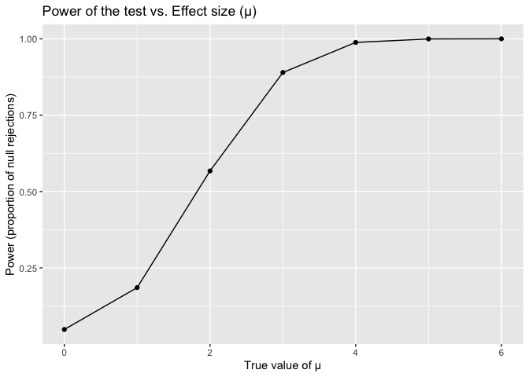
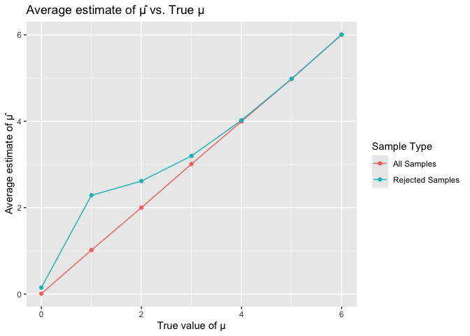
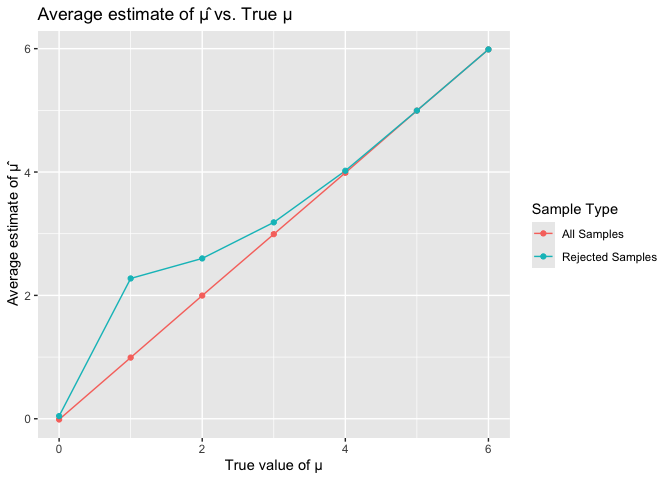

P8105_HW5_jg4890
================
Jiayi Ge
2024-11-01

# Probelm 1

# Problem 2

``` r
library(broom)
library(dplyr)
```

    ## 
    ## Attaching package: 'dplyr'

    ## The following objects are masked from 'package:stats':
    ## 
    ##     filter, lag

    ## The following objects are masked from 'package:base':
    ## 
    ##     intersect, setdiff, setequal, union

``` r
sim_power <- function(mu, n = 30, sigma = 5, alpha = 0.05) {
  sim_data <- tibble(
    x = rnorm(n, mean = mu, sd = sigma)
  )
  t_test_result <- t.test(sim_data$x, mu = 0)
  tidy_result <- broom::tidy(t_test_result)
  return(tibble(
    mu_hat = tidy_result$estimate,
    p_value = tidy_result$p.value
  ))
}
sim_results <- replicate(5000, sim_power(mu = 0, alpha = 0.05), simplify = FALSE) %>%
  bind_rows()

power <- mean(sim_results$p_value < 0.05)
power
```

    ## [1] 0.0494

``` r
library(ggplot2)
library(purrr)
mu_values <- 0:6
sim_results <- map_dfr(mu_values, function(mu) {
  replicate(5000, sim_power(mu = mu), simplify = FALSE) %>%
    bind_rows() %>%
    mutate(mu = mu)
})
power_results <- sim_results %>%
  group_by(mu) %>%
  summarize(power = mean(p_value < 0.05))

ggplot(power_results, aes(x = mu, y = power)) +
  geom_line() +
  geom_point() +
  labs(x = "True value of µ", y = "Power (proportion of null rejections)", 
       title = "Power of the test vs. Effect size (µ)")
```

<!-- --> The
plot demonstrates a clear positive relationship between effect size (μ)
and statistical power. As the true effect size increases, the
probability of correctly rejecting a false null hypothesis also
increases. This indicates that larger deviations from the null
hypothesis are more likely to be detected.

However, it’s important to note that the relationship between effect
size and power is not strictly linear. As the effect size becomes very
large, the power plateaus. This suggests that beyond a certain point,
further increases in effect size may not substantially increase the
probability of detecting a true effect.

``` r
avg_mu_hat <- sim_results %>%
  group_by(mu) %>%
  summarize(
    avg_mu_hat_all = mean(mu_hat),
    avg_mu_hat_reject = mean(mu_hat[p_value < 0.05])
  )

ggplot(avg_mu_hat, aes(x = mu)) +
  geom_line(aes(y = avg_mu_hat_all, color = "All Samples")) +
  geom_line(aes(y = avg_mu_hat_reject, color = "Rejected Samples")) +
  geom_point(aes(y = avg_mu_hat_all, color = "All Samples")) +
  geom_point(aes(y = avg_mu_hat_reject, color = "Rejected Samples")) +
  labs(x = "True value of µ", y = "Average estimate of µ̂", 
       title = "Average estimate of µ̂ vs. True µ",
       color = "Sample Type")
```

<!-- --> The
second plot focuses on the average estimated μ only for those
simulations where the null hypothesis was rejected. While there is still
a positive association between the true and estimated values, the
relationship becomes more pronounced as the true effect size (μ)
increases. This is because as the effect size grows, the power of the
test increases, leading to a higher proportion of correct rejections. As
a result, the average estimate from rejected simulations becomes more
accurate and closer to the true value of μ.

# Problem 3

``` r
library(tidyverse)
```

    ## ── Attaching core tidyverse packages ──────────────────────── tidyverse 2.0.0 ──
    ## ✔ forcats   1.0.0     ✔ stringr   1.5.1
    ## ✔ lubridate 1.9.3     ✔ tibble    3.2.1
    ## ✔ readr     2.1.5     ✔ tidyr     1.3.1
    ## ── Conflicts ────────────────────────────────────────── tidyverse_conflicts() ──
    ## ✖ dplyr::filter() masks stats::filter()
    ## ✖ dplyr::lag()    masks stats::lag()
    ## ℹ Use the conflicted package (<http://conflicted.r-lib.org/>) to force all conflicts to become errors

``` r
library(broom)
library(purrr)
homicides <- read_csv("https://raw.githubusercontent.com/washingtonpost/data-homicides/master/homicide-data.csv")
```

    ## Rows: 52179 Columns: 12
    ## ── Column specification ────────────────────────────────────────────────────────
    ## Delimiter: ","
    ## chr (9): uid, victim_last, victim_first, victim_race, victim_age, victim_sex...
    ## dbl (3): reported_date, lat, lon
    ## 
    ## ℹ Use `spec()` to retrieve the full column specification for this data.
    ## ℹ Specify the column types or set `show_col_types = FALSE` to quiet this message.

``` r
homicides_summary <- homicides %>%
  mutate(city_state = paste(city, state, sep = ", ")) %>%
  group_by(city_state) %>%
  summarize(
    total_homicides = n(),
    unsolved_homicides = sum(disposition %in% c("Closed without arrest", "Open/No arrest"))
  )

baltimore_data <- homicides_summary %>% filter(city_state == "Baltimore, MD")
baltimore_prop_test <- prop.test(baltimore_data$unsolved_homicides, baltimore_data$total_homicides)
baltimore_summary <- tidy(baltimore_prop_test)

baltimore_estimate <- baltimore_summary %>%
  select(estimate, conf.low, conf.high)

city_proportions <- homicides_summary %>%
  mutate(
    prop_test = map2(unsolved_homicides, total_homicides, ~ prop.test(.x, .y)),
    prop_summary = map(prop_test, tidy)
  ) %>%
  unnest(prop_summary) %>%
  select(city_state, estimate, conf.low, conf.high)
```

    ## Warning: There was 1 warning in `mutate()`.
    ## ℹ In argument: `prop_test = map2(unsolved_homicides, total_homicides,
    ##   ~prop.test(.x, .y))`.
    ## Caused by warning in `prop.test()`:
    ## ! Chi-squared approximation may be incorrect

``` r
city_proportions %>%
  ggplot(aes(x = reorder(city_state, estimate), y = estimate)) +
  geom_point() +
  geom_errorbar(aes(ymin = conf.low, ymax = conf.high), width = 0.2) +
  coord_flip() +
  labs(
    title = "Proportion of Unsolved Homicides by City",
    x = "City",
    y = "Proportion of Unsolved Homicides"
  )
```

<!-- -->
There are 52179 rows and 12 in the raw data. Some variables include
`uid`,`victim_last`, `victim_first`, `victim_race`, `victim_age`,
`victim_sex`, `city`, `state`, `lat`, and `lon`.
